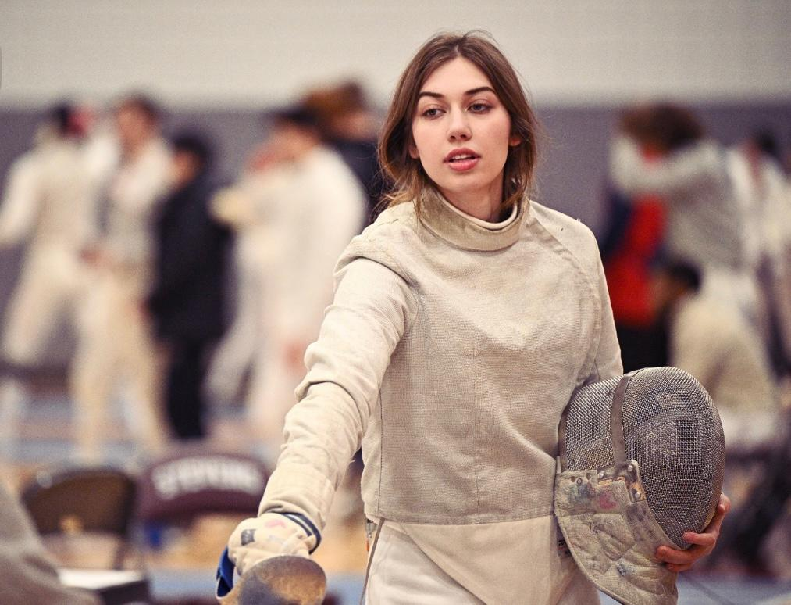

Hello, my name is Cassie Sehic. I've created this site to showcase some of my personality to future friends and employers. I make blog posts of whatever happens to cross my mind, showoff my personal projects, and store photos and art here. I hope you enjoy what you see!

### More About Me

I am a finance and technology student! I graduated from [NJIT](https://www.njit.edu/) in Spring 2023 with a B.S. in Information Technology and Web Applications. Currently, I am pursuing an M.B.A. in Finance at [Wagner College](https://wagner.edu/), and am set to graduate in Spring 2025. During my undergrad, I was a member of NJIT's Division I Fencing Team, and over four years, I recorded 217 total wins, with my best finish being 15th at the NCAA National Championships. Now, I currently serve as the Wagner Men's and Women's Division I [Assistant Fencing Coach](https://wagnerathletics.com/news/2023/8/21/mens-fencing-cassandra-sehic-named-fencing-graduate-assistant-coach.aspx). Fencing has been a huge part of my life, so many of my personal projects have to do with fencing. You can find some of them here.

Some of my other interests include philosophy, game theory, sports psychology, artificial intelligence, and economics. I am certainly not an expert in any of these studies, but love to discuss them with others, and many of the writings you will find on this site likely relate to one or more of these areas. I also love art, whether that be digital fashion, music, cosplay, writing, cooking, etc. I dabble in a little of everything.

### What About Future Me?

Where I work is a lot more important to me than what I do. I want to work for a business that has goals that I find interesting, and I want to be a contributing member towards reaching those goals. I believe I can learn anything I set my mind to, and I have already picked up some pretty useful skills in tech and finance in [my past work experiences](https://www.linkedin.com/in/cassandrasehic/), in school, and on my own. I'm looking for great opportunities, and to give those great opportunities all my passion and effort.
